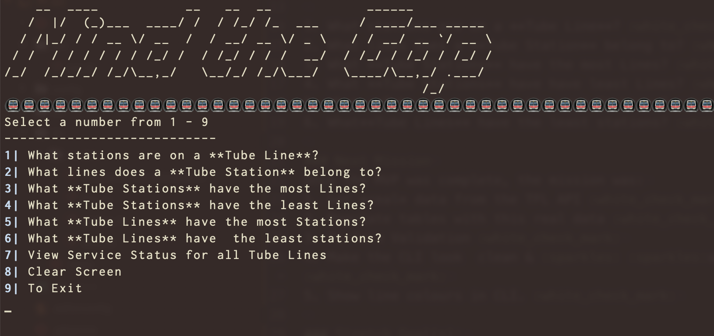
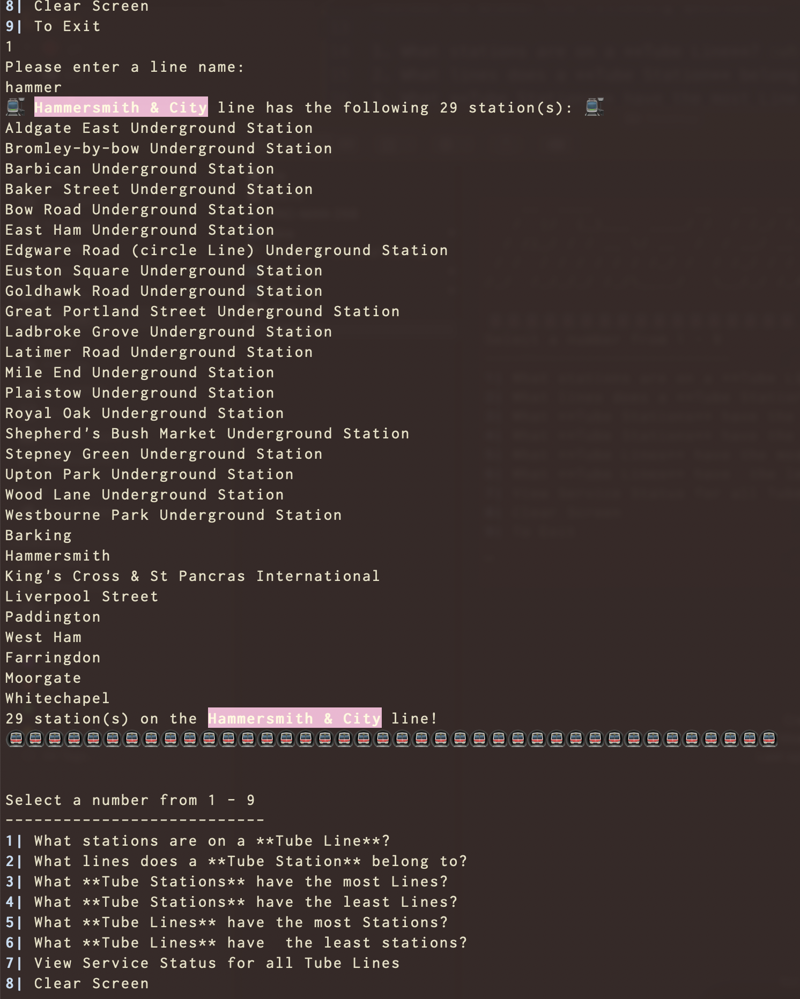
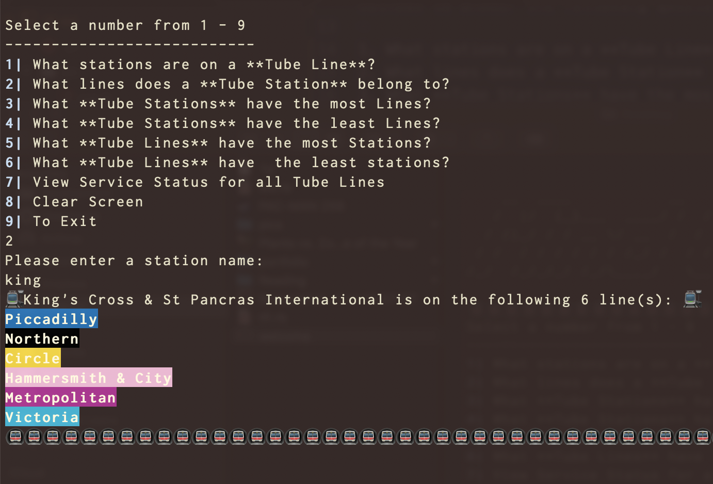
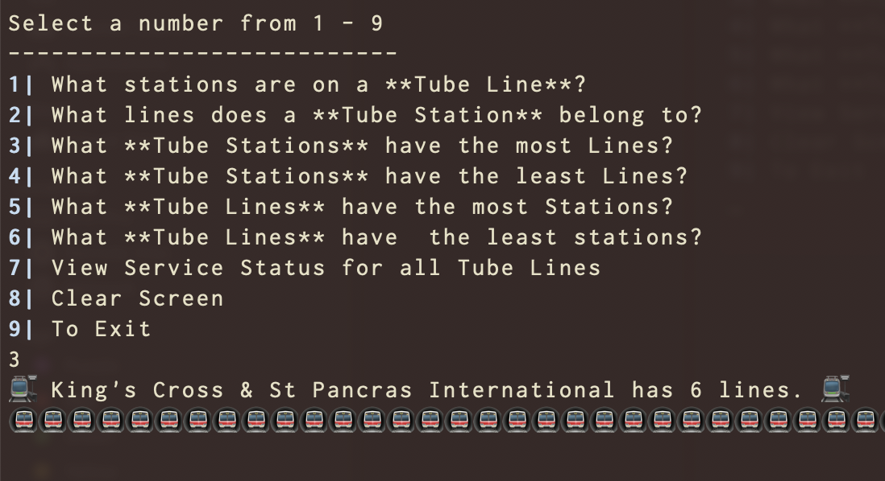
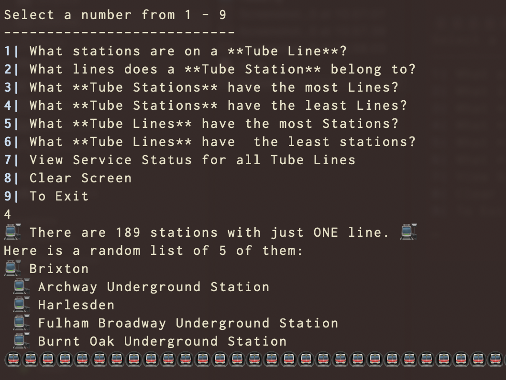
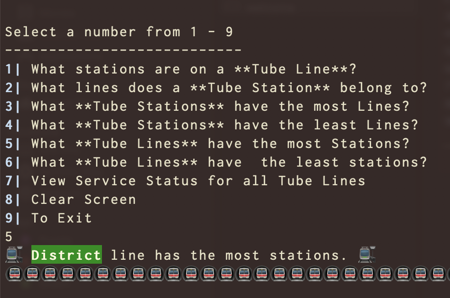
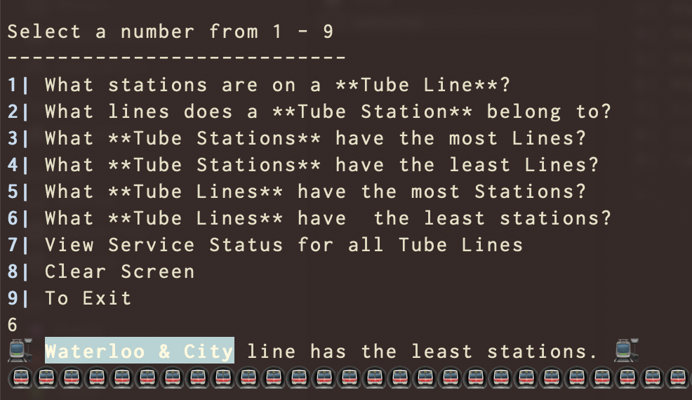
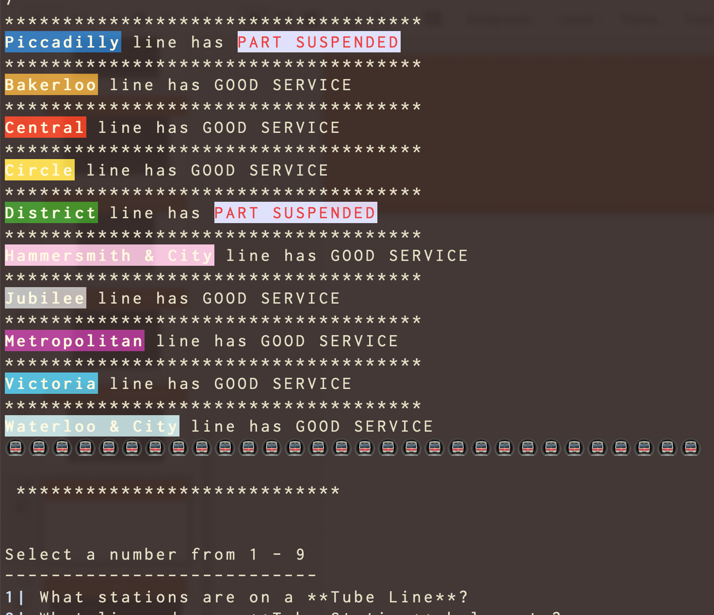
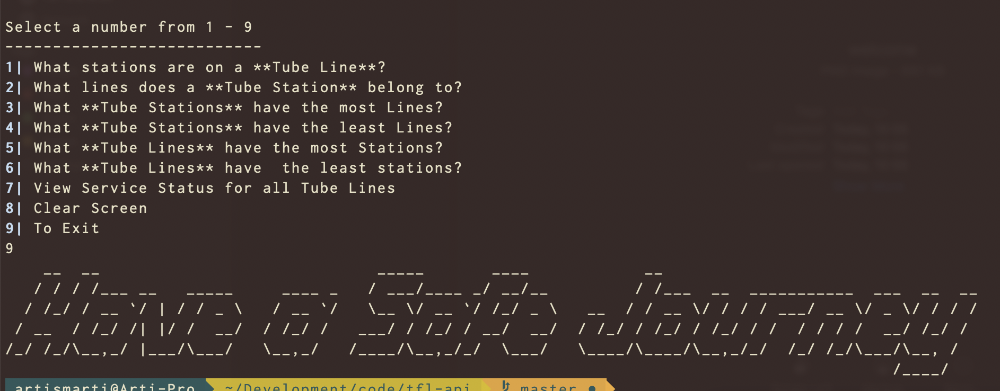

# :metro: Mind The Gap :metro:

## Using the TFL - API for the FlatIron Module 1 Final Project

The TFL API is called via Ruby to populate a hash with line names and station names.

The API is also used to get information about live disruptions.

## MVP, Next Mission and Stretch Goals

### MVP
For the MVP the aim was creating the classes, relationships and the methods to answer the following questions:

1. What stations are on a **Tube Line**? :white_check_mark:
2. What lines does a **Tube Station** belong to? :white_check_mark:
3. What **Tube Stations** have the most Lines? :white_check_mark:
4. What **Tube Stations** have have least Lines? :white_check_mark:
5. What **Tube Lines** have the most Stations? :white_check_mark:
6. What**Tube Lines** have the least stations? :white_check_mark:

### Next Mission
Once the MVP was complete, the mission was:
1. Get *real* data from the TFL API :white_check_mark:
2. Populate tables with this real data :white_check_mark:
3. Perform Validation :white_check_mark:
4. Make the CLI look  clean & :sparkles: :sparkles:sparkly. :white_check_mark:
5. Show line colours in CLI. :white_check_mark:

### Stretch Goal(s):
The main stretch goals are:
1. Get Live Service data from TFL API to show :no_entry_sign: disruptions:warning:. :white_check_mark:
2. Use emojis :sunglasses:in the :star2: CLI :white_check_mark:

### Super Stretchy Goal:
1. :bulb: Incorporate DLR and Overground data. :construction:
2. Clean up the code. :scream: :sob: :construction:


### Gems Used:
```
gem "sinatra-activerecord"
gem "sqlite3"
gem "pry"
gem "require_all"
gem 'rest-client'
gem 'json'
gem 'artii'
gem 'rainbow'
```

### Walkthrough:
#### Menu :clipboard:

#### What stations are on a **Tube Line**? :station:

#### 2. What lines does a **Tube Station** belong to? :mountain_cableway: :mountain_cableway: :aerial_tramway:

#### 3. What **Tube Stations** have the most Lines? :metro: :metro: :metro:

#### 4. What **Tube Stations** have have least Lines? :metro:

#### 5. What **Tube Lines** have the most Stations? :chart_with_upwards_trend: :metro:

#### 6. What **Tube Lines** have the least stations? :chart_with_downwards_trend: :metro:

#### 7. View Service Status for all Tube Lines :warning:

#### 9. Exit :wave:

